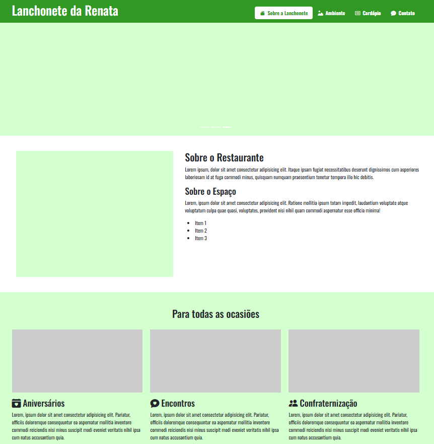

# Projeto 03: Site Lanchonete da Renata

## Requisitos da atividade:

1 - Crie uma outra landing page a partir do layout que construímos durante o módulo - o tema do site fica a seu critério;

2 - Publique o projeto na Vercel;

## Sobre a atividade:

- Achei bem simples só mudei a ideia de Restautante para uma lanchonete que conheço, utilizei a paleta de cor da lanchonete. Se fosse um projeto real estaria com traços fiel a tematica do comercio.
- Mantive toda pegada de utilizar o Bootstrap & jQuery.
- O site se comporta em outros dispositivos como: celular, tablet e computadores.

##

Clique para ver 👇

    <a href="">
        </img>
    </a>

